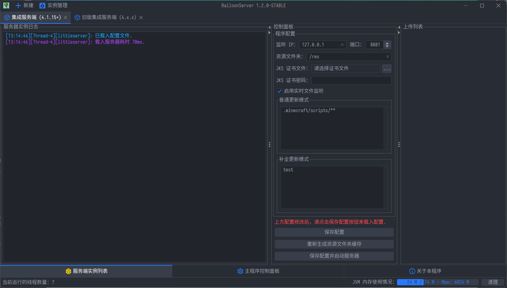

# BalloonServer 服务端 Manual
BalloonServer 是 LittleServer 的一个完全图形化扩展，并且底层基于高性能的 Netty-IO，性能更佳。
## 优点
- 99.9% 可视化操作，上手简单便捷
- 开箱即用，支持双击启动和 Shell 启动
- 支持配置重载
- 支持 SSL 证书
- 支持实时文件监听，实现全自动服务端维护
- 支持最小化到任务栏托盘（需要系统支持）
- 支持跨平台（Linux, Windows, MacOS）
- 高性能多线程处理，最大化利用服务器资源，减少卡顿
## 下载
你可以在 [GitHub Release](https://github.com/BalloonUpdate/BalloonServer/releases/tag/1.0.5-BETA) 或在我们的 [官方群聊](https://jq.qq.com/?_wv=1027&k=bhNBCnUQ) 内找到本软件的发行版。

**注意：从 1.0.6-BETA 版本起，程序的最低 JAVA 版本要求提高到了 17。**

下载程序后，双击 JAR 或执行命令 `java -jar BalloonServer-1.x.x-BETA.jar` 即可启动程序。

## 窗口介绍

- 橙色箭头所指的为程序日志，这里将输出程序的普通日志
- 红色箭头所指的为标签页窗口
- 黄色箭头所指的为控制面板，用于控制服务器 启动/关闭，以及配置服务器
- 蓝色箭头所指的为上传列表，当玩家向服务器获取文件时，会在此处显示上传进度

***提示：如果操作系统支持系统托盘，则关闭窗口的时候不会关闭程序，而是会最小化到任务栏。***
***左击托盘图标即可打开程序，右击托盘图标可打开菜单以退出程序。***

### 控制面板
控制面板将会是你后期最经常接触的面板，如果你不知道这些配置的含义，**请仔细阅读下方内容。**
#### 监听 IP, 端口
点击 `重载配置并启动服务器` 按钮时，程序将会监听此 `IP` 指定的`端口`的的传入请求。**如果你不知道这些内容的含义，请不要动它。**
#### 资源文件夹
程序将会 扫描/监听 的文件夹，默认为 `/res`，**如果无特殊需求，请不要动它。**
 - 资源文件夹是所有客户端的入口，以如果玩家访问除 `res.json` `index.json` `/res` 之外的路径，将会返回 403 错误。
 - 例如如果你需要更新客户端模组，请复制 Minecraft 客户端中所有的模组文件到 `res/.minecraft/mods/` 里（内部目录请自行创建），注意是所有文件。如果你要更新其它文件，同样按上面的方法，复制到 `/res` 目录里对应的路径的目录上（比如 `vexview` 的贴图复制到 `/res/.minecraft/vexview/textures/` 下，其它文件同理）
#### JKS 证书文件
用于 `HTTPS` 验证所需要的文件，如果没有 `JKS 证书`，则服务器默认使用 `HTTP` 协议与客户端传输。
 - `JKS 证书`即为后缀名为 `.jks` 的文件，点击输入框右方的 `选择` 按钮即可选择证书，证书可以在任何路径
#### JKS 证书密码
用于 `HTTPS` 验证所需要的文件，如果没有 `JKS 证书`，则服务器默认使用 `HTTP` 协议与客户端传输。

 - `JKS 证书密码`是用于验证完整性的密钥，如果没有它，即使拥有 `JKS 证书文件` 也无法正常使用 `HTTPS` 协议。

#### 最小化更新模式
此选项开启后，程序如果在生成缓存后变动文件，则不需要重新生成缓存文件，程序将会最小化检查差异更新，适合服务器 IO 性能较弱的情况下使用。

关闭后，程序每次更新缓存文件都会完整计算一次资源文件夹。

通常情况下推荐启用，除非在出现了 BUG 的情况下无法正常生成缓存时需要关闭以重新生成缓存。

*此功能以**多线程**方式计算文件差异，相比 LittleServer, 性能**更加优秀**。*
*此功能会在未来的版本内成为程序的一部分，不再提供 启用/关闭 功能*

#### 实时文件监听
此选项开启后，启动服务器的同时会启动文件监听服务。

文件监听服务会每隔 5 - 7 秒会统计一次资源文件夹的变化，如果资源一有变化就会**立即**重新生成资源缓存。

此功能使用最小化更新模式的方法生成缓存，并且**不需要**重启服务端。

适合在频繁变动文件的情况下使用此功能。

#### 普通更新模式 补全更新模式
`普通更新模式` ：客户端从服务器获取信息时，在此列表内的匹配的 `文件 / 文件夹` **都将会被更新**，规则可以是`正则表达式`、`Glob 表达式`

`补全更新模式` : 客户端从服务器获取信息时，只会在首次 `文件 / 文件夹` **不存在** 时会进行一次下载，如果后续文件存在，就会跳过更新**不会覆盖**已有内容。一般用来补全一些配置文件，规则可以是`正则表达式`、`Glob 表达式`。

 - 要新建一个更新规则，请在对应的列表内右击，然后在弹出的菜单内点击 `添加更新规则`，然后在弹出的对话框内输入更新规则。
 - 要删除一个更新规则，请先选中一个要删除的更新规则，然后右击，接着在弹出的菜单内点击 `删除更新规则`。
 - [一些更新规则示例](https://github.com/BalloonUpdate/Docs/blob/old-servers/server/reference.md)

#### 重载配置
点击后，服务端会将当前的程序配置应用到程序内，但是不会应用到服务器内。

#### 保存配置并重载
点击后，服务端会将当前的程序配置应用到程序内，并保存当前的配置文件至磁盘，但是不会应用到服务器内。

#### 重新生成资源文件夹缓存
点击后，服务端会主动生成资源文件夹的缓存，并保存至磁盘。并且会重载服务器的资源文件夹缓存。
***即使服务器正在运行，程序也可以重载服务器的缓存***

#### 重载配置并启动服务器
点击后，服务端会将当前的程序配置应用到程序内，并应用到服务器内，然后生成资源文件夹缓存，最后启动服务器。如果启用了 `实时文件监听` 功能，程序还会启动实时文件监听器。

#### 关闭服务器
点击后，服务端将会在完成最后任务后停止监听端口，如果启用了 `实时文件监听` 功能，程序也会关闭实时文件监听器。

*Enjoy it~*
